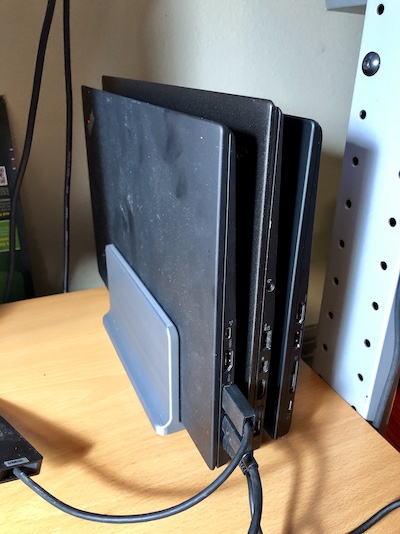

# 3D models

This repository contains the various 3D models that I have created for my own use. 

## Models

Images should be pretty self-explanatory

### Triple-laptop holder for Carbon X1 laptops. 18mm "gaps". Print with 50% infill.

[Model](models/3-laptop-stand.stl)

### GPU "spreader" for quad-GPU machines.

This will improve airflow with consumer GPUs.

### Cat food paper bowl holder.

## Notes on printing

These models were printed on a Prusa i3 Mk3 extrusion 3D printer. 
Be sure to lay the models flat on the bed for successful prints.

## License

This work is licensed under the terms of 
[Attribution-NonCommercial-ShareAlike 4.0](https://creativecommons.org/licenses/by-nc-sa/4.0/). 
Their commercial use is prohibited without a separate agreement.
